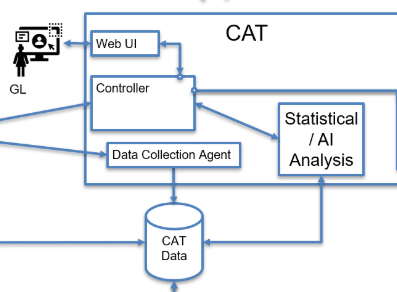

# Data Stream Visualization Workshop (CSCN8010) - Group 3

### Team Members
* Ricardo Mohammed (7500382)
* Senay Teweldebrhan (9120588)
* Zeynep Ozdemir (9045142)
* Juan Camilo Chirivi (9115141)

---

## Overview
For the Data Stream Visualization Workshop, we are tasked with creating a simulation of a robot's telemetry data. We are utilizing a dataset that tracks the Current (A) for different robot axes over time. 

Our primary goal is to loosely simulate the **CAT process** illustrated in class. 

## Project Tasks & CAT Mapping

| # | Project Task | CAT Process Role |
|---|---|---|
| **1** | Load the data from the CSV into Python | Robot data is collected by the Data Collection Agent |
| **2** | Persist the data in a relational database (Neon) | Data Collection Agent sends the data to the CAT Database |
| **3** | Read the data back from the Neon database and create a live dashboard of the data | Read the data back from the CAT Database |
| **4** | Look for anomalies and other observations based on the dashboard | Do Statistical Analysis / AI Analysis on the data |

---

<p align="center">
  
  <br>
  <em>Diagram 1: CAT Process Illustration</em>
</p>


## Setup Instructions

1. **Open a terminal** in the project root folder.
2. **Install the required packages**:
   ```bash
   pip install -r requirements.txt
   ```
3. **Configure your environment variables**:
   * Copy `.env.example` to a new file named `.env`.
   * Add your newly rotated Neon connection URL into the `.env` file:
     ```env
     DATABASE_URL=your_neon_connection_url_here
     ```
4. **Verify the data source**:
   * Check that `CSV_PATH` in `main.py` correctly points to your local CSV file.
5. **Run the application**:
   ```bash
   python main.py
   ```
